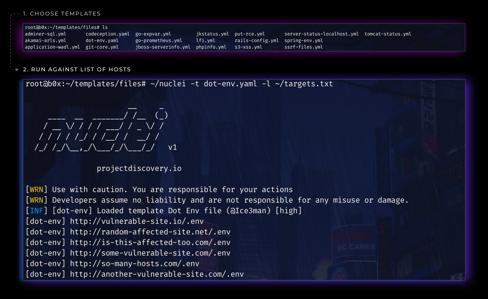

<h1 align="left">
  </a>
  <br>
</h1>

[](https://opensource.org/licenses/MIT)
[](https://goreportcard.com/report/github.com/projectdiscovery/nuclei)
[](https://github.com/projectdiscovery/nuclei/issues)

# nuclei

Nuceli is a fast tool to scan for things using configurable templates

# Resources
- [Resources](#resources)
- [Features](#features)
- [Usage](#usage)
- [Installation Instructions](#installation-instructions)
  - [Prerequisite](#prerequisite)
  - [Direct Installation](#direct-installation)
    - [From Binary](#from-binary)
    - [From Source](#from-source)
- [Running nuclei](#running-nuclei)
    - [1. Running nuclei with single template](#running-nuclei-with-a-single-template)
    - [2. Running nuclei with multiple template](#running-nuclei-with-a-multiple-template)


    - [A note on nuclei](#a-note-on-nuclei)
- [License](#license)

 # Features

<h1 align="left">
  </a>
  <br>
</h1>

 - Simple and modular code base making it easy to contribute.
 - Fast And Simple active subdomain scanning.
 - Handles wildcard subdomains in a smart manner.
 - Optimized for **ease of use**
 - **Stdin** and **stdout** support for integrating in workflows

# Usage

```bash
nuclei -h
```

This will display help for the tool. Here are all the switches it supports.

| Flag           | Description                                             | Example                              |
|----------------|---------------------------------------------------------|--------------------------------------|
| -c             | Number of concurrent requests (default 10)              | nuclei -c 100                    |
| -l             | List of urls to run templates                           | nuclei -l urls.txt               |
| -t             | Templates input file/files to check across hosts        | nuclei -t git-core.yaml          |
| -t             | Templates input file/files to check across hosts        | nuclei -t templates/*.yaml       |
| -nC            | Don't Use colors in output                              | nuclei -nC                       |
| -o             | File to save output result (optional)                   | nuclei -o output.txt             |
| -silent        | Show only found results in output                       | nuclei -silent                   |
| -retries       | Number of times to retry a failed request (default 1)   | nuclei -retries 1                |
| -t             | Seconds to wait before timeout (default 5)              | nuclei -t 5                      |
| -v             | Show Verbose output                                     | nuclei -v                        |
| -version       | Show version of nuclei                                  | nuclei -version                  |


# Installation Instructions


## Direct Installation

### From Binary

The installation is easy. You can download the pre-built binaries for your platform from the [Releases](https://github.com/projectdiscovery/nuclei/releases/) page. Extract them using tar, move it to your `$PATH`and you're ready to go.

```bash
> tar -xzvf nuclei-linux-amd64.tar
> mv nuclei-linux-amd64 /usr/bin/nuclei
> nuclei -h
```

### From Source

nuclei requires go1.13+ to install successfully. Run the following command to get the repo - 

```bash
> GO111MODULE=on go get -u -v github.com/projectdiscovery/nuclei/cmd/nuclei
```

In order to update the tool, you can use -u flag with `go get` command.

# Running nuclei

### 1. Running nuclei with a single template. 

This will run the tool against all the hosts in `urls.txt` and returns the matched results. 

```bash
> nuclei -l urls.txt -t git-core.yaml -o results.txt
```


You can also pass the list of hosts at standard input (STDIN). This allows for easy integration in automation pipelines.

This will run the tool against all the hosts in `urls.txt` and returns the matched results. 


```bash
> cat urls.txt | nuclei -t git-core.yaml -o results.txt
```

### 2. Running nuclei with a multiple template. 

This will run the tool against all the hosts in `urls.txt` and returns the matched results. 

```bash
> nuclei -l urls.txt -t "path-to-templates/*.yaml" -o results.txt 
```


You can also pass the list of hosts at standard input (STDIN). This allows for easy integration in automation pipelines.

This will run the tool against all the hosts in `urls.txt` and returns the matched results. 


```bash
> cat urls.txt | nuclei -t "path-to-templates/*.yaml" -o results.txt 
```


### A note on nuclei


# License

nuclei is made with 🖤 by the [projectdiscovery](https://projectdiscovery.io) team. Community contributions have made the project what it is. See the **[Thanks.md](https://github.com/projectdiscovery/nuclei/blob/master/THANKS.md)** file for more details.
