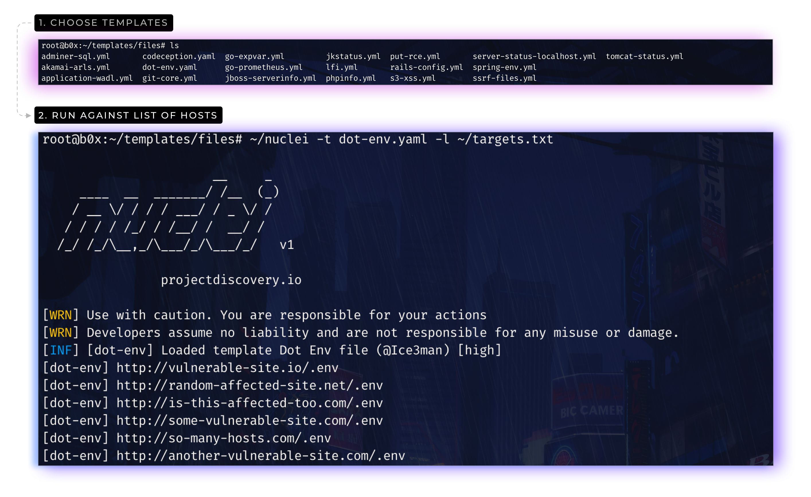

<h1 align="center">
  </a>
  <br>
</h1>

[](https://opensource.org/licenses/MIT)
[](https://goreportcard.com/report/github.com/projectdiscovery/nuclei)
[](https://github.com/projectdiscovery/nuclei/issues)
[](https://github.com/projectdiscovery/nuclei/releases)
[](https://twitter.com/pdnuclei)
[](https://hub.docker.com/r/projectdiscovery/nuclei)
[](https://discord.gg/KECAGdH)

<p align="center">
<a href="https://nuclei.projectdiscovery.io/templating-guide/" target="_blank"></center></a>  <a href="https://github.com/projectdiscovery/nuclei-templates" target="_blank"></a>
</p>


Nuclei是一个基于模板的、可配置攻击目标的扫描快速工具，同时还提供了强大的可扩展性和易用性。

基于模板的nuclei被用来发送请求给目标，有着实现零误报的优点，并且可以对已知的路径进行有效的扫描。nuclei的主要用于在初期的探测阶段快速地对已知的且易于检测的漏洞或者CVE进行扫描。如果存在WAF的话，nuclei使用[retryablehttp-go库](https://github.com/projectdiscovery/retryablehttp-go)来处理各种错误，并且重新尝试攻击，这也是我们自定义功能的核心模块之一。

我们也维护一个具有各个类型的模板的[开源库](https://github.com/projectdiscovery/nuclei-templates)，我们希望你也能贡献一些模板，贡献的这些模板最好是有效的，并且能允许每个人基于你的模板重新构建。查看[**nuclei.projectdiscovery.io**](https://nuclei.projectdiscovery.io/templating-guide/)这个网站去学习制作模板的入门知识。

## 目录

- [目录](#目录)
- [功能](#功能)
- [安装](#安装)
- [Nuclei模板](#nuclei模板)
- [用法](#用法)
- [运行Nuclei](#运行nuclei)
- [排除模板](#排除模板)
- [致谢](#致谢)

## 功能

<h1 align="left">
  </a>
  <br>
</h1>

- 有着易于开发的、简单的、模块化的代码库
- 使用了基于模板的引擎，运行速度极快，可以修改所以配置
- 可以对特殊情况处理、重试、绕过等，可以绕过WAF
- 智能匹配，零误报

## 安装

### 二进制文件安装

二进制文件安装很简单，你可以从[Releases](https://github.com/projectdiscovery/nuclei/releases/)页面下载已经构建好的二进制文件压缩包，使用解压工具提取下载的压缩包，并将解压的文件夹移动到$PATH目录，就可以直接使用了。

```sh
Download latest binary from https://github.com/projectdiscovery/nuclei/releases

▶ tar -xzvf nuclei-linux-amd64.tar.gz
▶ mv nuclei /usr/local/bin/
▶ nuclei -version
```

### 源码安装

nuclei需要**go1.14+**才能成功安装，运行以下命令获取repo

```sh
▶ GO111MODULE=on go get -v github.com/projectdiscovery/nuclei/v2/cmd/nuclei
```

### GitHub安装

```sh
▶ git clone https://github.com/projectdiscovery/nuclei.git; cd nuclei/v2/cmd/nuclei/; go build; mv nuclei /usr/local/bin/; nuclei -version
```

## Nuclei模板

你可以使用`update-templates`来下载和更新nuclei模板，该命令会从unclei的[模板库]()中下载最新版本，这个由社区来维护的库是可以随时使用的。

```sh
▶ nuclei -update-templates
```

此外您可以根据自己的工作情况或者需求编写模板，请参阅**nuclei[模板向导](https://nuclei.projectdiscovery.io/templating-guide/)去编写自定义模板**

## 用法

```sh
nuclei -h
```

这条命令会显示帮助，以下是nuclei支持的所有命令

|命令|描述|例子|
|-----|-----|-----|
|bulk-size|每个模板最大并行的主机数(默认25)|nuclei -bulk-size 25|
|burp-collaborator-biid|使用burp-collaborator插件|nuclei -burp-collaborator-biid XXXX|
|c|并行的最大模板数量(默认10)|nuclei -c 10|
|l|对URL列表进行测试|nuclei -l urls.txt|
|target|对目标进行测试|nuclei -target hxxps://example.com|
|t|要检测的模板种类|nuclei -t git-core.yaml -t cves/|
|no-color|输出不显示颜色|nuclei -no-color|
|no-meta|不显示匹配的元数据|nuclei -no-meta|
|json|输出为json格式|nuclei -json|
|include-rr|json输出格式中包含请求和响应数据|nuclei -json -include-rr|
|o|输出为文件|nuclei -o output.txt|
|project|避免发送相同的请求|nuclei -project|
|stats|使用进度条|nuclei -stats|
|silent|只输出测试成功的结果|nuclei -silent|
|retries|失败后的重试次数|nuclei -retries 1|
|timeout|超时时间(默认为5秒)|nuclei -timeout 5|
|trace-log|输出日志到log文件|nuclei -trace-log logs|
|rate-limit|每秒最大请求数(默认150)|nuclei -rate-limit 150|
|severity|根据严重性选择模板|nuclei  -severity critical,high|
|stop-at-first-match|第一次匹配不要处理HTTP请求|nuclei -stop-at-frst-match|
|exclude|排除的模板或文件夹|nuclei -exclude panels -exclude tokens|
|debug|调试请求或者响应|nuclei -debug|
|update-templates|下载或者升级模板|nuclei -update-templates|
|update-directory|选择储存模板的目录(可选)|nuclei -update-directory templates|
|tl|列出可用的模板|nuclei -tl|
|templates-version|显示已安装的模板版本|nuclei -templates-version|
|v|显示发送请求的详细信息|nuclei -v|
|version|显示nuclei的版本号|nuclei -version|
|proxy-url|输入代理地址|nuclei -proxy-url hxxp://127.0.0.1:8080|
|proxy-socks-url|输入socks代理地址|nuclei -proxy-socks-url socks5://127.0.0.1:8080|
|random-agent|使用随机的UA|nuclei -random-agent|
|H|自定义请求头|nuclei -H “x-bug-bounty:hacker”|

## 运行Nuclei

### 运行单个模板

这将对`urls.txt`中所有的主机运行`git-core.yaml`并返回结果到`results.txt`

```sh
▶ nuclei -l urls.txt -t files/git-core.yaml -o results.txt
```

你可以轻松的通过管道使用标准的输入(STDIN)传递URL列表。

```sh
▶ cat urls.txt | nuclei -t files/git-core.yaml -o results.txt
```

💡 Nuclei可以接受如下列表的URL作为输入，例如以下URL：

```
https://test.some-site.com
http://vuls-testing.com
https://test.com
```
### 运行多个模板

这将会对`urls.txt`中所有的URL运行`cves`和`files`模板检查，并返回输出到`results.txt`

```sh
▶ nuclei -l urls.txt -t cves/ -t files/ -o results.txt
```

### 使用subfinder运行

```sh
▶ subfinder -d hackerone.com -silent | httpx -silent | nuclei -t cves/ -o results.txt
```

### 在docker中运行

你需要使用[nuclei的docker镜像](https://hub.docker.com/r/projectdiscovery/nuclei)来运行

```sh
▶ docker pull projectdiscovery/nuclei
```

下载并构建完成后，运行以下命令：

```sh
▶ docker run -it projectdiscovery/nuclei
```

这将会对`urls.txt`中的URL通过docker中的nuclei进行检测，并将结果输出到本机的`results.txt`文件的：

```sh
▶ cat urls.txt | docker run -v /path/to/nuclei-templates:/app/nuclei-templates -v /path/to/nuclei/config:/app/.nuclei-config.json -i projectdiscovery/nuclei -t /app/nuclei-templates/files/git-config.yaml > results.txt
```
记住更改的模板路径到本机

### 速率限制

Nuclei有多种控制速率的方法，包括并行执行多个模板、并行检查多个主机，以及使nuclei限制全局的请求速率，下面就是示例。

- `-c`参数 => 限制并行的模板数
- `-bulk-size`参数 => 限制并行的主机数
- `-rate-limit`参数 => 全局速率限制

如果你想快速扫描或者控制扫描，请使用这些标志并输入限制数，`速率限制`只保证控制传出的请求，与其他参数无关。

### 排除模板

[Nuclei模板](https://github.com/projectdiscovery/nuclei-templates)包含多种检查，其中有许多对攻击有用的检查，但并不是都有用的。如果您只希望扫描少数特定的模板或目录，则可以使用如下的参数筛选模板，或将某些模板排除。

#### 排除模板运行

我们不建议同时运行所有的nuclei模板，如果要排除模板，可以使用`exclude`参数来排除特定的目录或模板。

```sh
nuclei -l urls.txt -t nuclei-templates -exclude panels/ -exclude technologies -exclude files/wp-xmlrpc.yaml
```

注意：如上述示例中显示的那样，目录和特定模板都将不会扫描

#### 基于严重性运行模板

您可以根据模板的严重性运行模板，扫描时可以选择单个严重性或多个严重性。

```sh
nuclei -l urls.txt -t cves/ -severity critical,medium
```

上面的例子将运行`cves`目录下所有`严重`和`中等`的模板。

```sh
nuclei -l urls.txt -t panels/ -t technologies -severity info
```

上面的例子将运行`panels`和`technologies`目录下严重性标记为`info`的模板

#### 使用`.nuclei-ignore`文件排除模板

自从nuclei的[v2.1.1版本](https://github.com/projectdiscovery/nuclei/releases/tag/v2.1.1)以来，我们添加了对`.nuclei-ignore`文件的支持，该文件与`update-templates`参数一起使用，在 **.nuclei-ignore** 文件中，您可以定义要从nuclei扫描中排除的所有模板目录或者模板路径，要开始使用此功能，请确保使用`nuclei-update-templates`参数安装nuclei模板，现在可以根据`.nuclei-ignore`的文件来添加、更新、删除模板文件。

```
nano ~/nuclei-templates/.nuclei-ignore
```

默认的**nuclei忽略**列表可以访问[这里]((https://github.com/projectdiscovery/nuclei-templates/blob/master/.nuclei-ignore)，如果不想排除任何内容，只需要删除`.nuclei-ignore`文件。

* * *

### 📋 笔记

- 进度条是实验性功能，在某些情况下可能无法使用。
- 进度条不适用于工作流，因为是条件执行，所以不准确。


## 致谢

也要看看这些类似的好项目，或许它们也适合你：

[Burp Suite](https://portswigger.net/burp), [FFuF](https://github.com/ffuf/ffuf), [Jaeles](https://github.com/jaeles-project/jaeles), [Qsfuzz](https://github.com/ameenmaali/qsfuzz), [Inception](https://github.com/proabiral/inception), [Snallygaster](https://github.com/hannob/snallygaster), [Gofingerprint](https://github.com/Static-Flow/gofingerprint), [Sn1per](https://github.com/1N3/Sn1per/tree/master/templates), [Google tsunami](https://github.com/google/tsunami-security-scanner), [ChopChop](https://github.com/michelin/ChopChop)

--------

Nuclei是由[projectdiscovery](https://projectdiscovery.io)团队用🖤制作的，当然社区也贡献了很多，通过 **[Thanks.md](https://github.com/projectdiscovery/nuclei/blob/master/THANKS.md)**文件以获取更多详细信息。