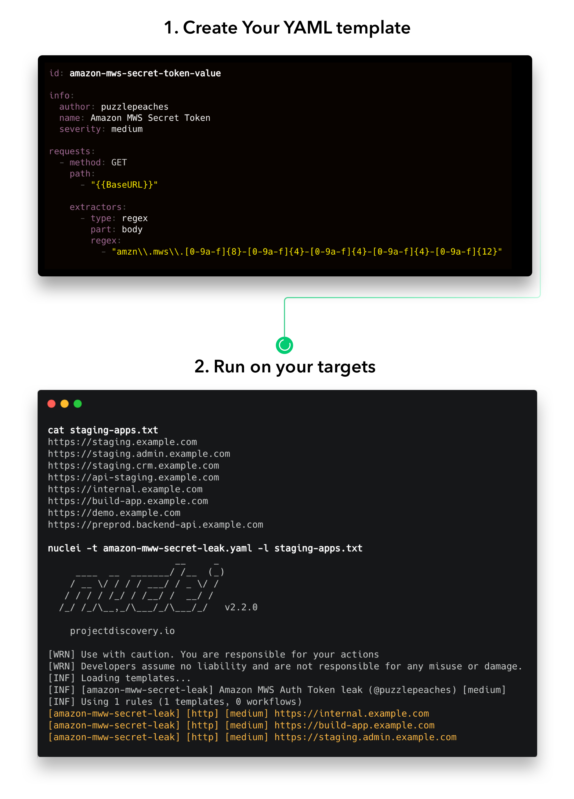
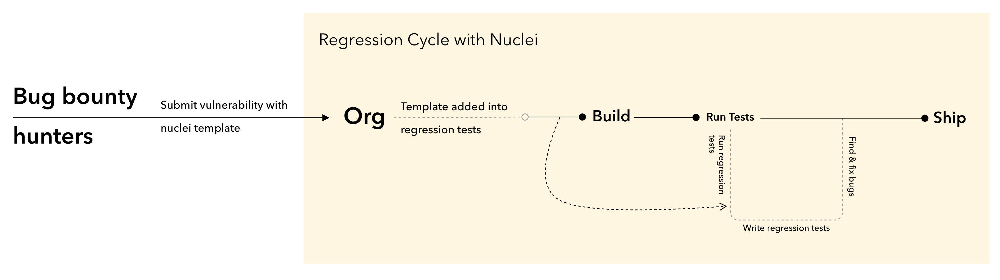

<h1 align="center">
  <br>
  <a href="https://nuclei.projectdiscovery.io"></a>
</h1>

<h4 align="center">Pemindai kerentanan yang cepat dan dapat disesuaikan berdasarkan DSL berbasis YAML sederhana.</h4>


<p align="center">

<a href="https://github.com/projectdiscovery/nuclei/releases">
<a href="https://github.com/projectdiscovery/nuclei/graphs/contributors">
<a href="https://github.com/projectdiscovery/nuclei/releases/">
<a href="https://github.com/projectdiscovery/nuclei/issues">
<a href="https://github.com/projectdiscovery/nuclei/discussions">
<a href="https://discord.gg/projectdiscovery"></a>
<a href="https://twitter.com/pdnuclei"></a>
</p>
      
<p align="center">
  <a href="#cara-kerja">Cara Kerja</a> •
  <a href="#instalasi-nuclei">Instalasi</a> •
  <a href="#untuk-insinyur-keamanan">Untuk Teknisi Keamanan</a> •
  <a href="#untuk-pengembang-dan-organisasi">Untuk Pengembang</a> •
  <a href="https://nuclei.projectdiscovery.io/nuclei/get-started/">Dokumentasi</a> •
  <a href="#kredit">Kredit</a> •
  <a href="https://nuclei.projectdiscovery.io/faq/nuclei/">Tanya Jawab</a> •
  <a href="https://discord.gg/projectdiscovery">Gabung Discord</a>
</p>

<p align="center">
  <a href="https://github.com/projectdiscovery/nuclei/blob/main/README.md">English</a> •
  <a href="https://github.com/projectdiscovery/nuclei/blob/main/README_CN.md">中文</a> •
  <a href="https://github.com/projectdiscovery/nuclei/blob/main/README_KR.md">Korean</a> •
  <a href="https://github.com/projectdiscovery/nuclei/blob/main/README_ID.md">Indonesia</a>
</p>

---

Nuclei digunakan untuk mengirim permintaan lintas target berdasarkan templat, yang menghasilkan nol positif palsu dan menyediakan pemindaian yang cepat pada banyak host. Nuclei menawarkan pemindaian untuk berbagai protokol, termasuk TCP, DNS, HTTP, SSL, File, Whois, Websocket, Headless, dll. Dengan templating yang kuat dan fleksibel, Nuclei dapat digunakan untuk memodelkan semua jenis pemeriksaan keamanan.

Kami memiliki [repositori khusus](https://github.com/projectdiscovery/nuclei-templates) yang menampung berbagai jenis templat kerentanan yang disumbangkan oleh **lebih dari 300** peneliti dan teknisi keamanan.


## Cara Kerja


<h3 align="center">
  </a>
</h3>


# Instalasi Nuclei

Nuclei membutuhkan **go1.21** agar dapat diinstall. Jalankan perintah berikut untuk menginstal versi terbaru -

```sh
go install -v github.com/projectdiscovery/nuclei/v3/cmd/nuclei@latest
```

**Metode [instalasi lain dapat ditemukan di sini](https://nuclei.projectdiscovery.io/nuclei/get-started/).**

<table>
<tr>
<td>  

### Nuclei Templates

Nuclei memiliki dukungan untuk unduhan/pembaruan templat otomatis sebagai bawaan sejak versi [v2.5.2](https://github.com/projectdiscovery/nuclei/releases/tag/v2.5.2). Proyek [**Nuclei-Templates**](https://github.com/projectdiscovery/nuclei-templates) menyediakan daftar template siap pakai yang dibuat oleh komunitas yang terus diperbarui.

Anda dapat menggunakan flag `-update-templates` untuk memperbarui templat inti kapan saja; Anda juga dapat menulis pemeriksaan Anda sendiri untuk alur kerja individu dan untuk kebutuhan Anda sendiri dengan mengikuti [panduan pembuatan templat Nuclei](https://nuclei.projectdiscovery.io/templating-guide/).

Untuk referensi penulisan sintaks DSL berbasis YAML tersedia [di sini](SYNTAX-REFERENCE.md).

</td>
</tr>
</table>

### Cara Pakai

```sh
nuclei -h
```

Ini akan menampilkan bantuan untuk alat tersebut. Berikut adalah semua flag yang didukungnya.


```console
Nuclei is a fast, template based vulnerability scanner focusing
on extensive configurability, massive extensibility and ease of use.

Usage:
  ./nuclei [flags]

Flags:
TARGET:
   -u, -target string[]       target URLs/hosts to scan
   -l, -list string           path to file containing a list of target URLs/hosts to scan (one per line)
   -resume string             resume scan using resume.cfg (clustering will be disabled)
   -sa, -scan-all-ips         scan all the IP's associated with dns record
   -iv, -ip-version string[]  IP version to scan of hostname (4,6) - (default 4)

TEMPLATES:
   -nt, -new-templates                    run only new templates added in latest nuclei-templates release
   -ntv, -new-templates-version string[]  run new templates added in specific version
   -as, -automatic-scan                   automatic web scan using wappalyzer technology detection to tags mapping
   -t, -templates string[]                list of template or template directory to run (comma-separated, file)
   -turl, -template-url string[]          template url or list containing template urls to run (comma-separated, file)
   -w, -workflows string[]                list of workflow or workflow directory to run (comma-separated, file)
   -wurl, -workflow-url string[]          workflow url or list containing workflow urls to run (comma-separated, file)
   -validate                              validate the passed templates to nuclei
   -nss, -no-strict-syntax                disable strict syntax check on templates
   -td, -template-display                 displays the templates content
   -tl                                    list all available templates
   -sign                                  signs the templates with the private key defined in NUCLEI_SIGNATURE_PRIVATE_KEY env variable
   -code                                  enable loading code protocol-based templates

FILTERING:
   -a, -author string[]               templates to run based on authors (comma-separated, file)
   -tags string[]                     templates to run based on tags (comma-separated, file)
   -etags, -exclude-tags string[]     templates to exclude based on tags (comma-separated, file)
   -itags, -include-tags string[]     tags to be executed even if they are excluded either by default or configuration
   -id, -template-id string[]         templates to run based on template ids (comma-separated, file)
   -eid, -exclude-id string[]         templates to exclude based on template ids (comma-separated, file)
   -it, -include-templates string[]   templates to be executed even if they are excluded either by default or configuration
   -et, -exclude-templates string[]   template or template directory to exclude (comma-separated, file)
   -em, -exclude-matchers string[]    template matchers to exclude in result
   -s, -severity value[]              templates to run based on severity. Possible values: info, low, medium, high, critical, unknown
   -es, -exclude-severity value[]     templates to exclude based on severity. Possible values: info, low, medium, high, critical, unknown
   -pt, -type value[]                 templates to run based on protocol type. Possible values: dns, file, http, headless, tcp, workflow, ssl, websocket, whois
   -ept, -exclude-type value[]        templates to exclude based on protocol type. Possible values: dns, file, http, headless, tcp, workflow, ssl, websocket, whois
   -tc, -template-condition string[]  templates to run based on expression condition

OUTPUT:
   -o, -output string            output file to write found issues/vulnerabilities
   -sresp, -store-resp           store all request/response passed through nuclei to output directory
   -srd, -store-resp-dir string  store all request/response passed through nuclei to custom directory (default "output")
   -silent                       display findings only
   -nc, -no-color                disable output content coloring (ANSI escape codes)
   -j, -jsonl                    write output in JSONL(ines) format
   -irr, -include-rr             include request/response pairs in the JSON, JSONL, and Markdown outputs (for findings only) [DEPRECATED use -omit-raw] (default true)
   -or, -omit-raw                omit request/response pairs in the JSON, JSONL, and Markdown outputs (for findings only)
   -nm, -no-meta                 disable printing result metadata in cli output
   -ts, -timestamp               enables printing timestamp in cli output
   -rdb, -report-db string       nuclei reporting database (always use this to persist report data)
   -ms, -matcher-status          display match failure status
   -me, -markdown-export string  directory to export results in markdown format
   -se, -sarif-export string     file to export results in SARIF format
   -je, -json-export string      file to export results in JSON format
   -jle, -jsonl-export string    file to export results in JSONL(ine) format

CONFIGURATIONS:
   -config string                        path to the nuclei configuration file
   -fr, -follow-redirects                enable following redirects for http templates
   -fhr, -follow-host-redirects          follow redirects on the same host
   -mr, -max-redirects int               max number of redirects to follow for http templates (default 10)
   -dr, -disable-redirects               disable redirects for http templates
   -rc, -report-config string            nuclei reporting module configuration file
   -H, -header string[]                  custom header/cookie to include in all http request in header:value format (cli, file)
   -V, -var value                        custom vars in key=value format
   -r, -resolvers string                 file containing resolver list for nuclei
   -sr, -system-resolvers                use system DNS resolving as error fallback
   -dc, -disable-clustering              disable clustering of requests
   -passive                              enable passive HTTP response processing mode
   -fh2, -force-http2                    force http2 connection on requests
   -ev, -env-vars                        enable environment variables to be used in template
   -cc, -client-cert string              client certificate file (PEM-encoded) used for authenticating against scanned hosts
   -ck, -client-key string               client key file (PEM-encoded) used for authenticating against scanned hosts
   -ca, -client-ca string                client certificate authority file (PEM-encoded) used for authenticating against scanned hosts
   -sml, -show-match-line                show match lines for file templates, works with extractors only
   -ztls                                 use ztls library with autofallback to standard one for tls13 [Deprecated] autofallback to ztls is enabled by default
   -sni string                           tls sni hostname to use (default: input domain name)
   -lfa, -allow-local-file-access        allows file (payload) access anywhere on the system
   -lna, -restrict-local-network-access  blocks connections to the local / private network
   -i, -interface string                 network interface to use for network scan
   -at, -attack-type string              type of payload combinations to perform (batteringram,pitchfork,clusterbomb)
   -sip, -source-ip string               source ip address to use for network scan
   -config-directory string              override the default config path ($home/.config)
   -rsr, -response-size-read int         max response size to read in bytes (default 10485760)
   -rss, -response-size-save int         max response size to read in bytes (default 1048576)
   -reset                                reset removes all nuclei configuration and data files (including nuclei-templates)
   -tlsi, -tls-impersonate               enable experimental client hello (ja3) tls randomization

INTERACTSH:
   -iserver, -interactsh-server string  interactsh server url for self-hosted instance (default: oast.pro,oast.live,oast.site,oast.online,oast.fun,oast.me)
   -itoken, -interactsh-token string    authentication token for self-hosted interactsh server
   -interactions-cache-size int         number of requests to keep in the interactions cache (default 5000)
   -interactions-eviction int           number of seconds to wait before evicting requests from cache (default 60)
   -interactions-poll-duration int      number of seconds to wait before each interaction poll request (default 5)
   -interactions-cooldown-period int    extra time for interaction polling before exiting (default 5)
   -ni, -no-interactsh                  disable interactsh server for OAST testing, exclude OAST based templates

FUZZING:
   -ft, -fuzzing-type string  overrides fuzzing type set in template (replace, prefix, postfix, infix)
   -fm, -fuzzing-mode string  overrides fuzzing mode set in template (multiple, single)

UNCOVER:
   -uc, -uncover                  enable uncover engine
   -uq, -uncover-query string[]   uncover search query
   -ue, -uncover-engine string[]  uncover search engine (shodan,censys,fofa,shodan-idb,quake,hunter,zoomeye,netlas,criminalip,publicwww,hunterhow) (default shodan)
   -uf, -uncover-field string     uncover fields to return (ip,port,host) (default "ip:port")
   -ul, -uncover-limit int        uncover results to return (default 100)
   -ur, -uncover-ratelimit int    override ratelimit of engines with unknown ratelimit (default 60 req/min) (default 60)

RATE-LIMIT:
   -rl, -rate-limit int               maximum number of requests to send per second (default 150)
   -rlm, -rate-limit-minute int       maximum number of requests to send per minute
   -bs, -bulk-size int                maximum number of hosts to be analyzed in parallel per template (default 25)
   -c, -concurrency int               maximum number of templates to be executed in parallel (default 25)
   -hbs, -headless-bulk-size int      maximum number of headless hosts to be analyzed in parallel per template (default 10)
   -headc, -headless-concurrency int  maximum number of headless templates to be executed in parallel (default 10)

OPTIMIZATIONS:
   -timeout int                        time to wait in seconds before timeout (default 10)
   -retries int                        number of times to retry a failed request (default 1)
   -ldp, -leave-default-ports          leave default HTTP/HTTPS ports (eg. host:80,host:443)
   -mhe, -max-host-error int           max errors for a host before skipping from scan (default 30)
   -te, -track-error string[]          adds given error to max-host-error watchlist (standard, file)
   -nmhe, -no-mhe                      disable skipping host from scan based on errors
   -project                            use a project folder to avoid sending same request multiple times
   -project-path string                set a specific project path (default "/tmp")
   -spm, -stop-at-first-match          stop processing HTTP requests after the first match (may break template/workflow logic)
   -stream                             stream mode - start elaborating without sorting the input
   -ss, -scan-strategy value           strategy to use while scanning(auto/host-spray/template-spray) (default auto)
   -irt, -input-read-timeout duration  timeout on input read (default 3m0s)
   -nh, -no-httpx                      disable httpx probing for non-url input
   -no-stdin                           disable stdin processing

HEADLESS:
   -headless                    enable templates that require headless browser support (root user on Linux will disable sandbox)
   -page-timeout int            seconds to wait for each page in headless mode (default 20)
   -sb, -show-browser           show the browser on the screen when running templates with headless mode
   -sc, -system-chrome          use local installed Chrome browser instead of nuclei installed
   -lha, -list-headless-action  list available headless actions

DEBUG:
   -debug                    show all requests and responses
   -dreq, -debug-req         show all sent requests
   -dresp, -debug-resp       show all received responses
   -p, -proxy string[]       list of http/socks5 proxy to use (comma separated or file input)
   -pi, -proxy-internal      proxy all internal requests
   -ldf, -list-dsl-function  list all supported DSL function signatures
   -tlog, -trace-log string  file to write sent requests trace log
   -elog, -error-log string  file to write sent requests error log
   -version                  show nuclei version
   -hm, -hang-monitor        enable nuclei hang monitoring
   -v, -verbose              show verbose output
   -profile-mem string       optional nuclei memory profile dump file
   -vv                       display templates loaded for scan
   -svd, -show-var-dump      show variables dump for debugging
   -ep, -enable-pprof        enable pprof debugging server
   -tv, -templates-version   shows the version of the installed nuclei-templates
   -hc, -health-check        run diagnostic check up

UPDATE:
   -up, -update                      update nuclei engine to the latest released version
   -ut, -update-templates            update nuclei-templates to latest released version
   -ud, -update-template-dir string  custom directory to install / update nuclei-templates
   -duc, -disable-update-check       disable automatic nuclei/templates update check

STATISTICS:
   -stats                    display statistics about the running scan
   -sj, -stats-json          display statistics in JSONL(ines) format
   -si, -stats-interval int  number of seconds to wait between showing a statistics update (default 5)
   -m, -metrics              expose nuclei metrics on a port
   -mp, -metrics-port int    port to expose nuclei metrics on (default 9092)

CLOUD:
   -auth                configure projectdiscovery cloud (pdcp) api key
   -cup, -cloud-upload  upload scan results to pdcp dashboard


EXAMPLES:
Run nuclei on single host:
	$ nuclei -target example.com

Run nuclei with specific template directories:
	$ nuclei -target example.com -t http/cves/ -t ssl

Run nuclei against a list of hosts:
	$ nuclei -list hosts.txt

Run nuclei with a JSON output:
	$ nuclei -target example.com -json-export output.json

Run nuclei with sorted Markdown outputs (with environment variables):
	$ MARKDOWN_EXPORT_SORT_MODE=template nuclei -target example.com -markdown-export nuclei_report/

Additional documentation is available at: https://docs.nuclei.sh/getting-started/running
```

### Menjalankan Nuclei

Memindai domain target dengan templat Nuclei yang [dikurasi oleh komunitas](https://github.com/projectdiscovery/nuclei-templates).

```sh
nuclei -u https://example.com
```

Memindai URL target dengan templat Nuclei yang [dikurasi oleh komunitas](https://github.com/projectdiscovery/nuclei-templates).

```sh
nuclei -list urls.txt
```

Contoh dari berkas `urls.txt`:

```yaml
http://example.com
http://app.example.com
http://test.example.com
http://uat.example.com
```

**Contoh lebih detil tentang menjalankan Nuclei dapat ditemukan [di sini](https://nuclei.projectdiscovery.io/nuclei/get-started/#running-nuclei).**

# Untuk Teknisi Keamanan

Nuclei menawarkan sejumlah besar fitur yang berguna bagi teknisi keamanan untuk menyesuaikan alur kerja di organisasi mereka. Dengan berbagai kemampuan pemindaian (seperti misalnya DNS, HTTP, TCP), teknisi keamanan dapat dengan mudah membuat rangkaian pemeriksaan khusus mereka dengan Nuclei.

- Berbagai protokol yang didukung: TCP, DNS, HTTP, File, dll
- Mencapai langkah-langkah kerentanan yang kompleks dengan alur kerja dan [permintaan dinamis](https://blog.projectdiscovery.io/nuclei-unleashed-quickly-write-complex-exploits/).
- Mudah diintegrasikan ke dalam CI/CD, dirancang agar mudah diintegrasikan ke dalam siklus regresi untuk secara aktif memeriksa perbaikan dan kemunculan kerentanan kembali.

<h1 align="left">
  <a href="https://nuclei.projectdiscovery.io/nuclei/get-started/"></a>
</h1>

<table>
<tr>
<td>  

**Untuk Pemburu Celah Berhadiah:**

Nuclei memungkinkan Anda untuk menyesuaikan pendekatan pengujian Anda dengan rangkaian pemeriksaan Anda sendiri dan dengan mudah menjalankan program celah berhadiah Anda. Selain itu, Nuclei dapat dengan mudah diintegrasikan ke dalam alur kerja pemindaian berkelanjutan.

- Dirancang agar mudah diintegrasikan ke dalam alur kerja alat lainnya.
- Dapat memproses ribuan host hanya dalam beberapa menit.
- Mudah mengotomatiskan pendekatan pengujian khusus Anda dengan sintaks DSL berbasis YAML sederhana kami.

Silakan periksa proyek sumber terbuka kami yang lain yang mungkin cocok dengan alur kerja celah berhadiah Anda: [github.com/projectdiscovery](http://github.com/projectdiscovery), kami juga menyediakan [penyegaran data DNS di Chaos setiap hari](http://chaos.projectdiscovery.io).

</td>
</tr>
</table>

<table>
<tr>
<td>
  
**Untuk Penguji Penetrasi:**

Nuclei sangat meningkatkan cara Anda mendekati penilaian keamanan dengan menambah proses manual yang berulang. Para konsultan sudah mengonversi langkah penilaian manual mereka dengan Nuclei, ini memungkinkan mereka untuk menjalankan serangkaian pendekatan penilaian khusus mereka di ribuan host secara otomatis.

Para penguji penetrasi mendapatkan kekuatan penuh dari templat publik dan kemampuan penyesuaian kami untuk mempercepat proses penilaian mereka, dan khususnya dengan siklus regresi di mana Anda dapat dengan mudah memverifikasi perbaikannya.

- Mudah untuk membuat daftar pemeriksa kepatuhan Anda, sederet standar (mis., OWASP 10 Teratas).
- Dengan kemampuan seperti [fuzz](https://nuclei.projectdiscovery.io/templating-guide/protocols/http-fuzzing/) dan [alur kerja](https://nuclei.projectdiscovery.io/templating-guide/workflows/), langkah manual yang rumit dan penilaian berulang dapat dengan mudah diotomatisasi dengan Nuclei.
- Mudah untuk menguji ulang perbaikan kerentanan hanya dengan menjalankan ulang template.

</td>
</tr>
</table>


# Untuk Pengembang dan Organisasi

Nuclei dibangun dengan kesederhanaan dalam pemikiran, dengan templat yang didukung komunitas oleh ratusan peneliti keamanan, memungkinkan Anda untuk tidak tertinggal dengan ancaman keamanan terbaru menggunakan pemindaian Nuclei terus menerus pada host. Ini dirancang agar mudah diintegrasikan ke dalam siklus pengujian regresi, untuk memverifikasi perbaikan dan menghilangkan kerentanan agar tidak terjadi di masa mendatang.

- **CI/CD:** Pengembang sudah memanfaatkan Nuclei dalam aliran CI/CD mereka, ini memungkinkan mereka untuk terus memantau lingkungan pementasan dan produksi mereka dengan templat yang disesuaikan.
- **Siklus Regresi Berkelanjutan:** Dengan Nuclei, Anda dapat membuat templat khusus pada setiap kerentanan baru yang teridentifikasi dan dimasukkan ke dalam mesin Nuclei untuk dihilangkan dalam siklus regresi berkelanjutan.

Kami memiliki [utas diskusi tentang ini](https://github.com/projectdiscovery/nuclei-templates/discussions/693), sudah ada beberapa program celah berhadiah yang memberikan insentif kepada peretas untuk menulis templat inti dengan setiap pengiriman, yang membantu mereka untuk menghilangkan kerentanan di semua aset mereka, serta untuk menghilangkan risiko masa depan yang muncul kembali pada lingkungan produksi. Jika Anda tertarik untuk menerapkannya di organisasi Anda, jangan ragu untuk [menghubungi kami](mailto:contact@projectdiscovery.io). Kami akan dengan senang hati membantu Anda dalam proses memulai, atau Anda juga dapat memposting ke [utas diskusi](https://github.com/projectdiscovery/nuclei-templates/discussions/693) untuk bantuan apapun.

<h3 align="center">
  </a>
</h3>

<h1 align="left">
  <a href="https://github.com/projectdiscovery/nuclei-action"></a>
</h1>

### Sumber Daya

- [Menemukan bug dengan menggunakan Nuclei dengan PinkDraconian (Robbe Van Roey)](https://www.youtube.com/watch?v=ewP0xVPW-Pk) oleh **[@PinkDraconian](https://twitter.com/PinkDraconian)** 
- [Nuclei: Mengemas Pukulan dengan Pemindaian Kerentanan](https://bishopfox.com/blog/nuclei-vulnerability-scan) oleh **Bishopfox**
- [Kerangka kemanjuran WAF](https://www.fastly.com/blog/the-waf-efficacy-framework-measuring-the-effectiveness-of-your-waf) oleh **Fastly**
- [Memindai Aplikasi Web Langsung dengan Nuclei di Aliran CI/CD](https://blog.escape.tech/devsecops-part-iii-scanning-live-web-applications/) oleh **[@TristanKalos](https://twitter.com/TristanKalos)**
- [Pemindaian Bertenaga Komunitas dengan Nuclei](https://blog.projectdiscovery.io/community-powered-scanning-with-nuclei/)
- [Nuclei Unleashed - Menulis eksploitasi kompleks dengan cepat](https://blog.projectdiscovery.io/nuclei-unleashed-quickly-write-complex-exploits/)
- [Nuclei - Fuzz semua hal](https://blog.projectdiscovery.io/nuclei-fuzz-all-the-things/)
- [Integrasi Nuclei + Interactsh untuk Mengotomatiskan Pengujian OOB](https://blog.projectdiscovery.io/nuclei-interactsh-integration/)
- [Mempersenjatai Alur Kerja Nuclei untuk Menghancurkan Semua Hal](https://medium.com/@dwisiswant0/weaponizes-nuclei-workflows-to-pwn-all-the-things-cd01223feb77) oleh **[@dwisiswant0](https://github.com/dwisiswant0)**
- [Bagaimana Memindai Terus-menerus dengan Nuclei?](https://medium.com/@dwisiswant0/how-to-scan-continuously-with-nuclei-fcb7e9d8b8b9) oleh **[@dwisiswant0](https://github.com/dwisiswant0)**
- [Retas dengan Otomatisasi !!!](https://dhiyaneshgeek.github.io/web/security/2021/07/19/hack-with-automation/) oleh **[@DhiyaneshGeek](https://github.com/DhiyaneshGeek)**

### Kredit

Terima kasih kepada semua komunitas yang luar biasa yang [berkontribusi untuk mengirimkan PR](https://github.com/projectdiscovery/nuclei/graphs/contributors). Lihat juga proyek sumber-terbuka serupa di bawah ini yang mungkin sesuai dengan alur kerja Anda:

[FFuF](https://github.com/ffuf/ffuf), [Qsfuzz](https://github.com/ameenmaali/qsfuzz), [Inception](https://github.com/proabiral/inception), [Snallygaster](https://github.com/hannob/snallygaster), [Gofingerprint](https://github.com/Static-Flow/gofingerprint), [Sn1per](https://github.com/1N3/Sn1per/tree/master/templates), [Google tsunami](https://github.com/google/tsunami-security-scanner), [Jaeles](https://github.com/jaeles-project/jaeles), [ChopChop](https://github.com/michelin/ChopChop)

### Lisensi

Nuclei didistribusikan di bawah [Lisensi MIT](https://github.com/projectdiscovery/nuclei/blob/main/LICENSE.md)

<h1 align="left">
  <a href="https://discord.gg/projectdiscovery"></a> <a href="https://nuclei.projectdiscovery.io"></a>
</h1>
