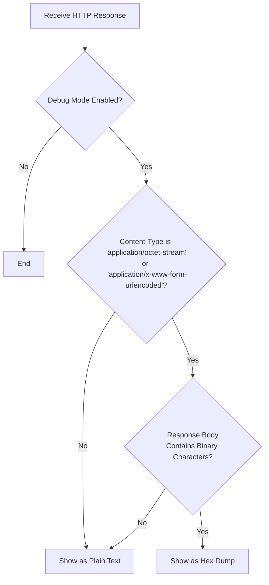

# Issue: Incorrect Hex Dump for HTTP Responses in Debug Mode

## Problem

When running `nuclei` in debug mode (`-debug`), HTTP responses were sometimes being displayed as a hex dump, even when the content was clearly text-based (e.g., JSON). This made it difficult to inspect legitimate text responses.

The root cause was that the response dumping logic was too aggressive. The check would trigger a hex dump if the `Content-Type` header was `application/octet-stream`, regardless of the actual content of the response body. The logic did not verify if the body contained binary data; the header alone was sufficient to cause the issue.

In the reported case, the server was responding with `Content-Type: application/octet-stream` for JSON payloads. Because of the flawed check, this immediately triggered the hex dump without inspecting the response body, which was plain text.

## Solution

The response handling logic was refined to be more precise. Now, a response is only displayed as a hex dump if it meets **both** of the following criteria:
1. The `Content-Type` is `application/octet-stream` or `application/x-www-form-urlencoded`.
2. The response body actually contains binary (non-ASCII) characters.

This change ensures that text-based responses like JSON are always displayed as plain text, regardless of the `Content-Type` header, while still correctly dumping legitimate binary content.

### New Response Handling Logic

The following diagram illustrates the updated decision-making process for displaying responses in debug mode.

